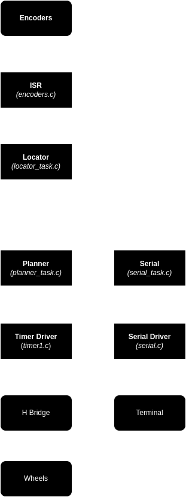
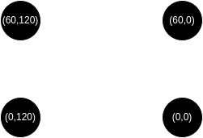

# PID Controller with Xinu

## Overview

This repository contains a PID (Proportional-Integral-Derivative) controller implementation with modular components for various functionalities. The project is structured into different modules, each serving a specific role in the control system. It was made to run into an Arduino Nano (clone) in a variation of Xinu OS

Content included:
>**econders.c**: Encoder Module (makes use of the ISR)
**locator_task.c**: Locator Module
**planner_task.c**: Planner Module
**serial_task.c**: Serial Module
**serial.c** and **serial.h**: Serial driver for the Arduino Nano
**timer1.c** and **timer1.h**: Timer 1 driver
**mat.c**: Math library
**data_structures.c** and **data_structures.h**: Data structures used in the project

---

## Modules


### 1. Encoder Module
The `encoder.c` is an interrupt service routine (ISR) for each encoder, when an encoder changes its state, it sends a signal to the `INT0` (right wheel) or to the `INT1` (left wheel), depending on the direction of the wheel it will increase or decrease the count of the right or left wheel.
For the conection between the encoder and the microcontroller board, it needs a resistor to prevent noise so the ISR only is executed when a tick has happend.

### 2. Locator Module
The `locator_task.c` uses the `WHEEL_DIAMETER`, `WHEEL_SEPARATION`, `ENCODER_RES` and the ammounts of ticks on the right and the left wheel (given by the encoder module) since last execution of the module to calcule the car X, Y and angle.

### 3. Planner Module
The `planner_task.c` is the core of the program, using the X, Y and the angle of the car provided by the locator module, it decides what to do next. 
The definitions needed for the hardware are:
 - `LW_FWD_PORT`
 - `LW_REV_PORT`
 - `RW_FWD_PORT`
 - `RW_REV_PORT`
 - `WHEEL_DIAMETER` (same as in the Locator Module)
 - `WHEEL_SEPARATION` (same as in the Locator Module)
 - `MIN_SPEED` (from 0 to 1 defines the minimum speed of the wheels)

The definitions needed for the PID are:
 - `Kp`: proportional
 - `Ki`: integral
 - `Kd`: derivate
 - `dT`: time between executions of the module

The code works like this:
1. Calculates the actual error between the car and the target.
2. If the car is 3 positions away from the target, it considers that the target has been achieved, so it will:
    * Stablish a new target and pivots the car to make the car points at the target
    * If there arent more targets, it simply stops the car.

3. If the car is too far from the target, it computes the `angle_error`.
4. With that `angle_error` the PID is defined like this:
   ```c
    proportional = error_angle;
    integral = integral + error_angle;
    derivate = (error_angle - derivate);
    pid = Kp * proportional + Ki * integral + Kd * derivate;
    derivate = error_angle;
    ```
5. Then, according to the PID number (depending on the sign of the number is the direction error to be corrected, so minus is left and positive right) it gets the final 0 to 1 speed number for each wheel applying the `MIN_SPEED` defined early.
6. Sleeps for `dT` time.

### 4. Serial Module
The `serial_task.c` prints the car position and angle given by the locator module using the serial driver defined in the `serial.h`

---

## Usage
In `main.c` you will need to define the targets, you can add a target like so:
>queue_enqueue_values(&targets, **x**, **y**);

The order of the `queue_enqueue_values` will be the order of the execution.

In order to flash the Xinu SO and the PID program into the arduino, conect the arduino serial port, in the terminal, standing in `./xinu/compile` execute:
>make clean
make
make flash

---
## Hardware Used
- Arduino Nano
- H-Bridge L298n
- 2 CC Motors
- 2 Encoders
- 2 56K Resistor

---

# Example
I included a predefined route that represents a rectangle like so:


>queue_enqueue_values(&targets, 60.0, 0.0);
	queue_enqueue_values(&targets, 60.0, 120.0);
	queue_enqueue_values(&targets, 0.0, 120.0);
	queue_enqueue_values(&targets, 0.0, 0.0);


---